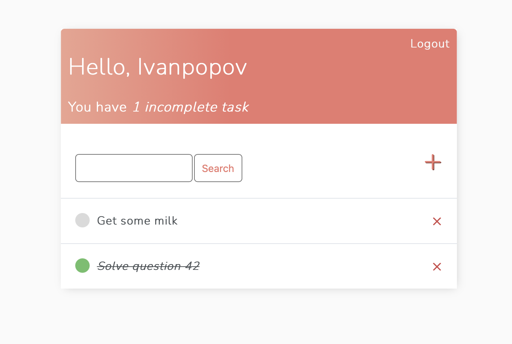

# Django To-Do app with user authentication

To Do list app with User Registration, Login, Search and full Create Read Update and DELETE functionality.

Based on class views.

To run:
------
1. Create virtual environment
2. Install packages from requirements.txt
3. Migrate models
```
python3 manage.py migrate   
```
4. Create superuser
```
python3 manage.py createsuperuser   
```
5. Run server
```
python3 manage.py runserver  
```
6. Dev server available at http://127.0.0.1:8000/


